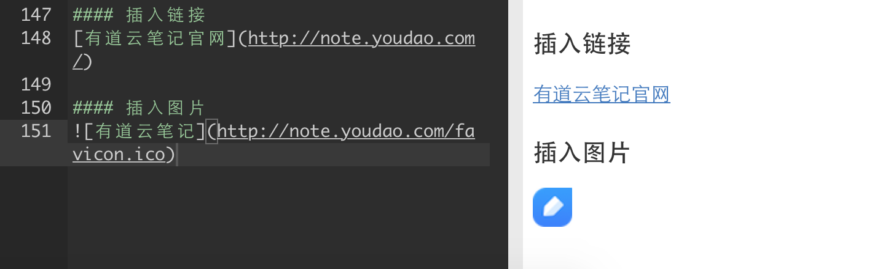

### 代码高亮
``` java
class Test{
	private String foo;
	
	public void bar(){
	
	}
	
	public static void main(String[] args){
		System.out.printlt("Hello");
	}
}
```
### To-do List
- [x] 已完成项目1
	- [x] 已完成事项1
	- [x] 已完成事项2
- [ ]  待办事项2
- [ ]  待办事项2  

### MD简明使用指南
#### 标题

# 一级标题
## 二级标题
### 三级标题
#### 四级标题
##### 五级标题
###### 六级标题

####  无序列表
- 列表1
	- 列表1.1
	- 列表1.2
- 列表2
- 列表3
#### 有序列表
1. 列表1
	1. 列表 1.1
	2. 列表 1.2
2. 列表2
3. 列表3
#### 引用
如果你需要在文稿中引用一段别处的句子，那么就要用到「引用」格式。
在引用文字前加上 > 并与文字保留一个字符的空格，即可。
> 记录，成为更好的自己。----有道云笔记

#### 粗体 斜体
*这是斜体*
** 这是粗体 **

#### 链接
[有道云笔记] (http://note.youdao.com)
#### 图片
![互联网图片] (http://note.youdao.com/favicon.ico)

#### 分割线
这是一段内容
***
这是另一段内容

#### 表格

| header1 | header2 |
| ------- | ------- |
| col1    | col2    |
| col2    | clo2    |

